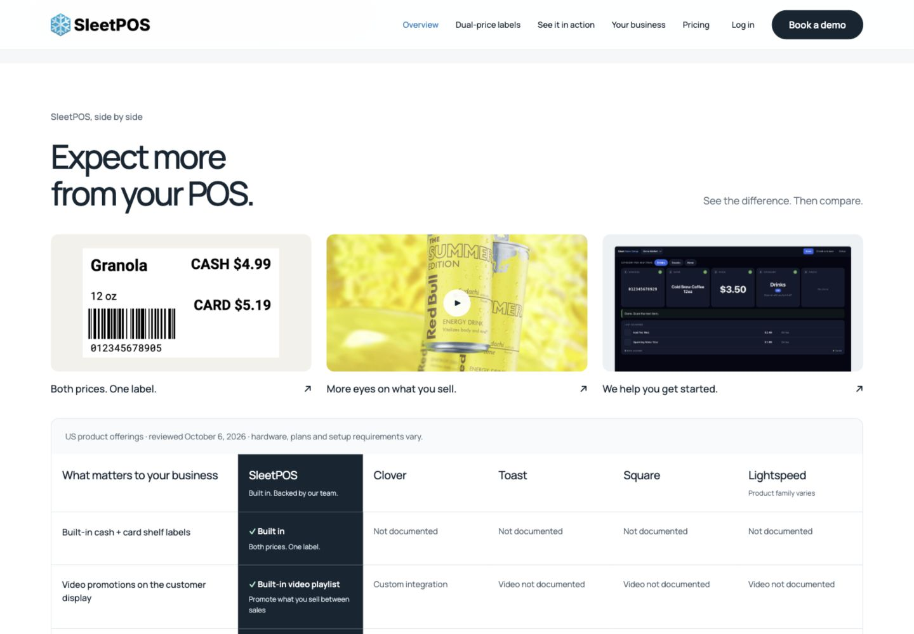
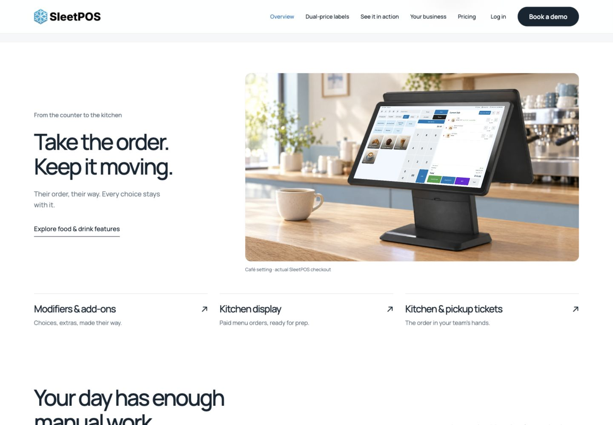

# Merchant website release and closeout — October 6, 2026

Owner closeout instruction: “good, push and commit everyrhing and make sure that you comply with the slots thing and document this”.

## Published work

- Merchant website: `4dc36b7b99ad8bd43f9c125be3231dbe510b0758`, on website main and verified live at https://www.sleetpos.com/ and https://sleetsystems.com/product/.
- Matching login/reset/activation: `87f8d536845d72ce1ca577175f3a2a87e5595994`, on dashboard main and already verified live.
- Canonical system map: `LAND_VISUAL` marked shipped. This closeout adds records/evidence; the published page code and images are unchanged.
- Owner decisions are recorded separately on the required `chore/launch-cleanup` branch, never merged into main. The closeout instruction is recorded in `36eb90da`.

## Slot compliance

Website work is delivered and Slot 3 is closed. The website branch note is parked as release history. Slot 1 (EBT terminal work) and Slot 2 (custom labels) remain unchanged. Archival and documentation are housekeeping; no new feature slot was opened. The branch dashboard check passes.

## Saved work

All eight unused earlier design experiments are committed and pushed under Git tag `archive/merchant-website-experiments-2026-10-06`, archive commit `5bc7560fbb912039b4db14c95f29bf901d8cc0a2`. They are preserved at their original relative paths in that commit, separate from main, so rejected animations and the earlier UI are not redeployed. `archive-manifest.json` records sizes and SHA-256 hashes. Local copies were moved to the workspace’s `Design/archive/merchant-website-experiments-2026-10-06/` after remote archival was verified.

To recover, fetch the archive tag and use `git show <tag>:<path>` for a file, or `git archive <tag> <path>...` for selected files. The archive commit includes `ARCHIVE-NOTES.md` explaining why those files are inactive. Never reset production to that archive commit.

## Verification evidence

[Release report](visual-refinement-release.md), [static check results](visual-refinement-static-check.json), [live HTTP/hash results](visual-refinement-live-http.json), and [setup image provenance](setup-image-provenance.md).

Desktop and 390px mobile screenshots are included. The final live checks found no missing comparison images, no horizontal document overflow and no browser errors. The setup image viewer and its links work. The original site feature release also verified the video/cart switching and Pricing view. Pricing, placement terms and sourced comparison rows remain unchanged.

